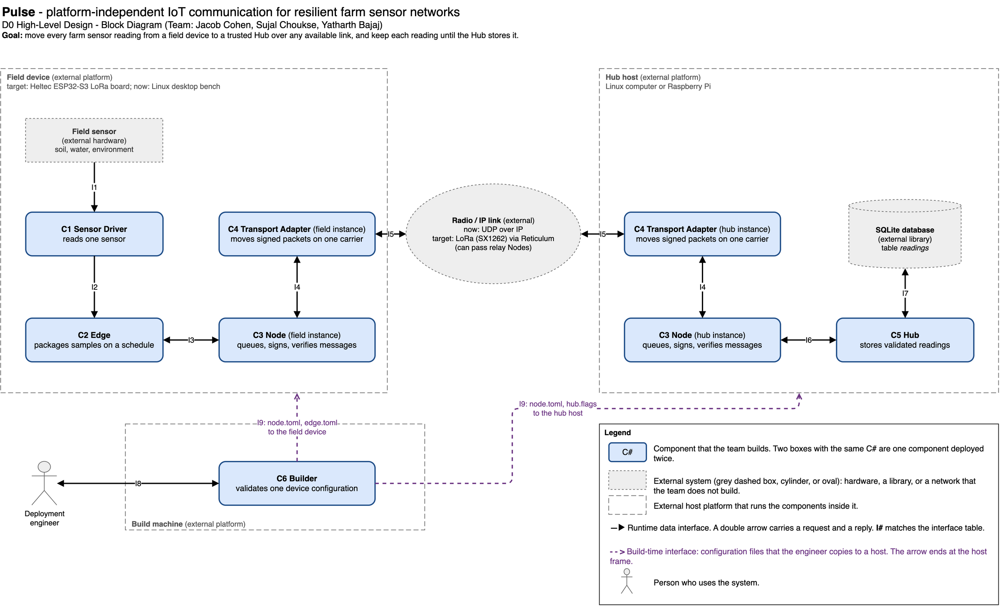
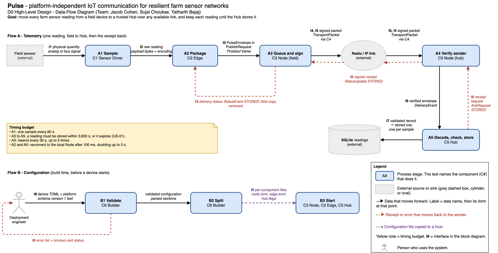

**Team:** Jacob Cohen, Sujal Choukse, Yatharth Bajaj\
**Advisor:** Jeffrey Gundler

## 1. Title, goal statement, and conventions

**Project title:** Pulse - platform-independent IoT communication for resilient farm sensor networks.

**Goal statement:** Move every farm sensor reading from a field device to a trusted Hub over any available link, and keep each reading until the Hub stores it.

**Basic input:** a measurement from a field sensor (soil, water, or environment). Each device also gets one configuration file before it starts.

**Basic output:** a stored row for each reading in the Hub database, with the sender identity and the collection time. The field device gets a `STORED` receipt back.

**Conventions.** Both diagrams use the same symbols, and each diagram has its own legend.

| Symbol | Meaning |
|----|----------|
| Blue rounded box, **C#** | A component that we build. Two boxes with the same C# are one component that runs on two hosts. |
| Grey dashed box, cylinder, or oval | An external system that we do not build: hardware, a library, or a network. |
| Large dashed frame | A host platform. The components inside the frame run on it. |
| Stick figure | A person who uses the system. |
| Solid arrow, **I#** | A runtime interface. A double arrow carries a request and a reply. I# matches the table in part 4. |
| Purple dashed arrow | Configuration files that the engineer copies to a host. |
| Red dashed arrow | A receipt or an error that goes back to the sender. |
| **A#** / **B#** box | A stage in the data-flow diagram. The box names the component that does the stage. |

## 2. Block diagram (D0)



Pulse has six components (C1 to C6) and nine interfaces (I1 to I9). The Node (C3) and the Transport Adapter (C4) run on every device, so they appear once on the field device and once on the hub host.

Today the system runs on Linux computers and uses UDP over IP between devices. The target field device is a Heltec ESP32-S3 board that sends over LoRa through Reticulum.

## 3. Component responsibility table

| ID | Component | Responsibility | In | Out | Owner |
|--|----|----------|---|---|----|
| C1 | Sensor Driver | Reads one sensor type and returns its raw reading. | I1 | I2 | Sujal Choukse |
| C2 | Edge | Turns each scheduled sample into a delivery request for the local Node. | I2, I3, I9 | I3 | Yatharth Bajaj |
| C3 | Node | Keeps each outgoing message until the requested receipt arrives or the message expires. | I3, I4, I6, I9 | I3, I4, I6 | Jacob Cohen |
| C4 | Transport Adapter | Moves signed packets between the Node and one carrier: UDP now, LoRa later. | I4, I5 | I4, I5 | Jacob Cohen |
| C5 | Hub | Stores each valid reading once, then confirms that it is stored. | I6, I7, I9 | I6, I7 | Yatharth Bajaj |
| C6 | Builder | Checks a device configuration file and splits it into one file for each component. | I8 | I8, I9 | Sujal Choukse |

The Node also checks sender identities, because a message is only delivered when it comes from a trusted sender. The shared protocol package (message definitions and test vectors) is not a component, because it does not run. It defines the message formats for I3, I5, and I6.

**Traceability.** Each user story maps to at least one component, and each component maps to at least one story.

| User story | Components |
|--------|---|
| US-01: readings reach the Hub after an outage | C2, C3, C4, C5 |
| US-02: samples stay queued until the Hub stores them | C3, C5 |
| US-03: reject an invalid configuration before installation | C6 |
| US-04: add a sensor through the driver and decoder contracts | C1, C5 |
| US-05: accept records only from approved identities | C3 |

## 4. Interface specification table

| ID | From → To | Inputs | Outputs | Format | Protocol | On error (handled by) |
|-|---|------|------|----|----|------|
| I1 | Field sensor → C1 | physical quantity: analog or digital signal | reading: bytes | Value native to the sensor | Sensor bus (I2C, UART, or ADC). The `sim-env` driver simulates it today. | The read fails and C1 returns `DriverError`. (C1) |
| I2 | C1 → C2 | `sample()` call | `payload`: bytes; `encoding`: string, for example `application/json` | Driver result | Function call through the `SensorDriver` contract | C2 logs the error and skips that sample. The schedule continues. (C2) |
| I3 | C2 ↔ C3 | `PublishRequest{destination: string, message: PulseEnvelope, ack: AckMode, want_acceptance: bool}` | `Response{ok: bool, error: ErrorDetail}`; `StatusEvent{message_id: string, status: DeliveryStatus, detail: string}` | Protobuf `RpcEnvelope` with a 4-byte length prefix, 1 MiB maximum | TCP on the loopback address only | The Node returns `QUEUE_FULL` or `INVALID_MESSAGE`, or sends a bad frame. The connection closes and the Edge reconnects after 100 ms, doubling up to 5 s. (C3 detects, C2 recovers) |
| I4 | C3 ↔ C4 | outgoing `TransportPacket` bytes and the next peer | incoming `TransportPacket` bytes and the source | Serialized `TransportPacket` | Function call through the `Transport` contract | The send fails. The Node keeps the message and tries again at the next retry time. (C3) |
| I5 | C4 ↔ C4 over the radio or IP link | `TransportPacket{payload: SignedPayload, sender_identity: 32 bytes, signature: 64 bytes, ttl: uint32}` | the same packet at the receiver | Protobuf, signed with ed25519 | One UDP datagram per packet today; a Reticulum packet over LoRa later | The receiver drops packets from unknown peers or with bad signatures. The sender resends every 30 s, up to 5 times, and marks the message `EXPIRED` after 3,600 s. (receiving C3 drops, sending C3 recovers) |
| I6 | C3 ↔ C5 | `SubscribeRequest{service: string}`; `AckRequest{message_id: string, status: STORED}` | `DeliveryEvent{destination: string, message: PulseEnvelope, authenticated_sender: bytes}` | Protobuf `RpcEnvelope`, same framing as I3 | TCP on the loopback address only | The Hub reconnects and subscribes again after 100 ms, doubling up to 5 s. An event that is lost gets no receipt, so the sender resends it. (C5, sending C3) |
| I7 | C5 ↔ SQLite | one row per sample: `origin_id`, `message_id`, `sensor_id`, `encoding`: text; `payload`, `authenticated_sender`: blob; `collected_at_ms`, `received_at_ms`: integer | `STORED` or `DUPLICATE` | Row in table `readings`, keyed on (`origin_id`, `message_id`, `sensor_id`) | JDBC; `INSERT OR IGNORE` in one transaction | The transaction rolls back and the Hub sends no receipt, so the sender resends. (C5) |
| I8 | Engineer ↔ C6 | configuration file: TOML, `schema_version = 1`; platform: `linux`, `windows`, or `esp32` | validation report: text; exit status: integer | TOML file and command-line arguments | Command-line program on the build machine | The Builder lists each error, exits with a nonzero status, and leaves the file unchanged. (C6) |
| I9 | C6 → C2, C3, C5 | validated configuration | `node.toml`, `edge.toml`: TOML; `hub.flags`: text | TOML and command-line flags | File copy to the host | The component stops at startup with an error, and systemd restarts it. (receiving component) |

The main enumerations are `AckMode` (`ACK_NONE`, `ACK_RECEIVED`, `ACK_STORED`) and `DeliveryStatus` (`RECEIVED`, `STORED`, `EXPIRED`, `FAILED`).

**Example payload.** This `PulseEnvelope` carries one soil moisture reading over I3 and I5. It is shown as JSON here and sent as Protobuf.

```json
{
  "envelope_version": 1,
  "message_id": "11111111-2222-3333-4444-555555555555",
  "origin_id": "field-01",
  "collected_at_ms": 1788912000000,
  "samples": [
    { "sensor_id": "soil-1", "encoding": "application/json",
      "payload": "{\"moisture\":0.42}" }
  ]
}
```

## 5. Data-flow diagram



**Flow A: telemetry.** A reading changes form at each stage.

1. **A1 Sample (C1):** the sensor signal becomes a raw reading.
2. **A2 Package (C2):** the raw reading becomes a `PulseEnvelope` with a message ID, the origin ID, and the collection time.
3. **A3 Queue and sign (C3, field):** the envelope waits in the queue and is sent as a signed packet.
4. **A4 Verify sender (C3, hub):** the packet becomes a verified envelope with the sender identity.
5. **A5 Decode, check, store (C5):** the envelope becomes a validated record, then one stored row per sample.

After the row is stored, the Hub asks its Node to send a `STORED` receipt. The receipt goes back over the link. The field Node then deletes its copy and tells the Edge.

**Flow B: configuration.** The engineer gives a configuration file to the Builder. The Builder checks it (B1) and splits it (B2) into `node.toml`, `edge.toml`, and `hub.flags`. Each component starts with its own file (B3). If the file is not valid, the engineer gets a list of errors.

**Timing budget.**

| Item | Value |
|------|----|
| Sample interval | 60 s |
| Time before an undelivered message expires (US-01) | 3,600 s |
| Resend interval | 30 s, up to 5 times |
| Reconnect to the local Node | 100 ms, doubling up to 5 s |

## 6. Architecture pattern and justification

Pulse is a **pipeline**, with **layers** inside each device and an **embedded sensor loop** on the field device.

| Pattern | Where it applies |
|---|---------|
| Pipeline | The telemetry path: sample, package, queue and sign, carry, verify, store. Each stage has one job and passes one data form to the next. |
| Layered | Inside each device: the Edge or the Hub on top, then the Node, then the Transport Adapter, then the carrier. Each layer uses only the layer below it. |
| Embedded sensor-actuator | The field device reads its sensors on a fixed schedule. The first release has sensors only. |
| Client-server (local) | On each host, the Node is a local server, and the Edge and the Hub are its clients. |

**Why these patterns fit, using the five criteria.**

1. **Fit to the problem.** Readings move one way through fixed stages, and receipts move back. A pipeline matches this. The layers let us move from UDP to LoRa by changing only C4.
2. **Team skills.** We know Rust, Java, Linux, and networking. Fixed contracts between the stages let each person build and test one part alone with shared test vectors.
3. **Performance and timing.** A reading every 60 s with a 3,600 s deadline is a low data rate. The real limit is LoRa airtime, so messages use compact Protobuf and the design adds no extra network services.
4. **Scalability.** One Hub collects from many field devices. A new device only needs a configuration file and a trusted identity, and relay Nodes extend the range. One farm fits easily in one SQLite database.
5. **Hardware and project constraints.** The field device is a battery-powered ESP32-S3 board, so its software stack must stay small, and battery devices do not relay packets. We have a $200 budget and one LoRa board, so the design needs no cloud service or paid software. Every packet is signed, and the local server accepts only connections from the same host.

**Rejected patterns.**

- **Microservices.** Each service would need its own network API and deployment. An ESP32-S3 cannot run this, a team of three cannot maintain it, and a farm has no reliable network to connect the services.
- **Cloud client-server.** Field devices would send straight to a cloud server. This fails on a farm with no internet access, which breaks the goal of delivery over any available link, and it adds a monthly cost.

## 7. Decision log

| ID | Decision | Alternatives | Why this option |
|-|------|----|-------|
| DL-1 | Run the Node, the Edge, and the Hub as separate programs. | One program per device; one program for the whole system. | If the Edge or the Hub fails, the Node keeps forwarding. Each program restarts on its own, and the Hub can be rewritten in another language. |
| DL-2 | Use Protobuf over loopback TCP for the local connection. | gRPC; HTTP with JSON. | Protobuf is small enough for LoRa and generates code for Rust and Java. gRPC and HTTP need a server stack that an ESP32 cannot run. Loopback only means that no other machine can connect. |
| DL-3 | Put the carrier behind a Transport Adapter, and prove the system on UDP before adding LoRa. | Build on LoRa hardware from the start. | We can test every other component on laptops now. Our advisor agreed to prove the data path on computers before full hardware support. |
| DL-4 | Send the `STORED` receipt only after the database commit, and remove duplicates with the key (`origin_id`, `message_id`, `sensor_id`). | Send the receipt as soon as the packet arrives. | An early receipt loses the reading if the Hub stops before it commits. Resends keep the same message ID, so a resend never creates a second row. |
| DL-5 | Sign every packet with an ed25519 key, and accept only peers in a trust table. | No authentication; TLS. | US-05 allows only approved senders. TLS needs a connection, and LoRa packets have none. The signing follows Reticulum's model, so we do not invent our own cryptography. |
| DL-6 | Store readings in SQLite on the hub host. | PostgreSQL; a cloud database. | SQLite needs no server or network and runs on a Raspberry Pi. One farm does not need more. A cloud database fails without internet access. |
